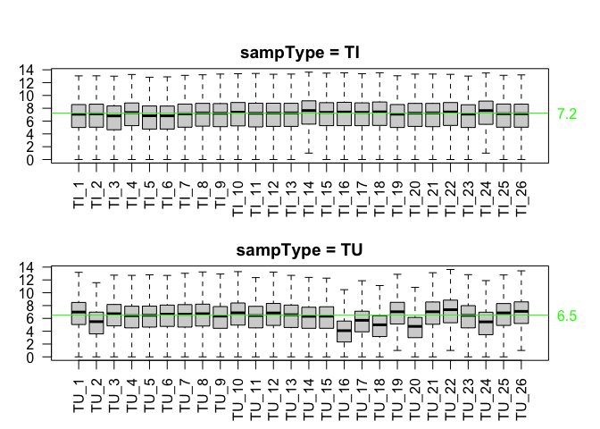

GSE112679 R Data Package
================

-----

<!-- README.md is generated from README.Rmd. Please edit that file -->

This package contains data from NCBI GEO [Series
GSE112679](https://www.ncbi.nlm.nih.gov/geo/query/acc.cgi?acc=GSE112679).
Data methylation profiles were collected to investigate genome-wide
mapping of 5-hydroxymethylcytosines in circulating cell-free DNA as
reported in Cai et al. (2019)
(<https://gut.bmj.com/content/68/12/2195>).

<!-- [@Cai:2019aa] pandoc citations dont work on github (github_document?) -->

## Data sets

``` r
  library(GSE112679)

  tmp <- data(package='GSE112679')
  knitr::kable(tmp$results[, c("Item", "Title")])
```

| Item                | Title                                                           |
| :------------------ | :-------------------------------------------------------------- |
| TUTI\_featureCount  | A matrix of feature counts for the matched Tumor/Tissue samples |
| Train\_featureCount | A matrix of feature counts for the samples in the training set  |
| Val1\_featureCount  | A matrix of feature counts for the samples in validation set 1  |
| Val2\_featureCount  | A matrix of feature counts for the samples in validation set 2  |
| genes\_annot        | A data frame describing the features                            |
| sampDesc            | A data frame describing the samples in the GSE112679 dataset    |

## Installation

``` r
# install.packages("devtools")
devtools::install_github("12379Monty/GSE112679")
```

## Example

``` r
library(magrittr)
library(GSE112679)
```

sampType is used to distinguish blood from tissue samples. The latter
can be tumor or tumor adjacent (sampType==TI).

``` r
with(sampDesc, table(sampType, trainValGroup, exclude=NULL))
#>         trainValGroup
#> sampType Train Val-1 Val-2 <NA>
#>    blood  1120  1194   240    0
#>    TI        0     0     0   26
#>    TU        0     0     0   26
```

  - For blood samples, outcome is specific Dx which can be used to
    investigate 5hmc profile differences between healthy, benign and
    malignant samples.

<!-- end list -->

``` r
with(sampDesc %>% dplyr::filter(sampType=='blood'), 
     table(outcome, trainValGroup, exclude=NULL))
#>            trainValGroup
#> outcome     Train Val-1 Val-2
#>   Benign      253   132     3
#>   CHB         190    96     0
#>   Cirrhosis    73    33     0
#>   HCC         335   809    60
#>   Healthy     269   124   177
```

  - outcome2 pools Benign+Healthy and Cirrhosis+CHB.

<!-- end list -->

``` r
with(sampDesc %>% dplyr::filter(sampType=='blood'), 
     table(outcome2, trainValGroup, exclude=NULL))
#>                trainValGroup
#> outcome2        Train Val-1 Val-2
#>   BenignHealthy   522   256   180
#>   CirrhosisCHB    263   129     0
#>   HCC             335   809    60
```

  - outcome3 is HCC vs the rest.

<!-- end list -->

``` r
with(sampDesc %>% dplyr::filter(sampType=='blood'), 
    table(outcome3, trainValGroup, exclude=NULL))
#>         trainValGroup
#> outcome3 Train Val-1 Val-2
#>   HCC      335   809    60
#>   nonHCC   785   385   180
```

  - sampDesc is used to provide sample information for the feature count
    data.

<!-- end list -->

``` r
TUTI_samdesc <- sampDesc[colnames(TUTI_featureCount),]

with(TUTI_samdesc, table(sampType, tissueSubtype,exclude=NULL))
#>         tissueSubtype
#> sampType tumor adjacent sample tumor sample
#>       TI                    26            0
#>       TU                     0           26

par(mfrow=c(2,1), mar=c(4,3,2,3),oma=c(0,0,2,0))
for(ST in unique(TUTI_samdesc$sampType)){
  ST_ndx <- which(TUTI_samdesc$sampType==ST)
  boxplot(log2(TUTI_featureCount+1)[,ST_ndx], outline=F, las=2, 
          ylab='log2(count+1)', xaxt='n')
  axis(side=1, outer=F, at=1:length(ST_ndx), 
       label=TUTI_samdesc$title[ST_ndx],las=2)
  title(paste('sampType =', ST)) 

  sample_median <- apply(log2(TUTI_featureCount[,ST_ndx]+1),2,median)
  abline(h=median(sample_median), col='green')
  axis(side=4, at=round(median(sample_median),1),las=2, 
       col.axis='green', line=-0.5,tick=F)
 
}
```



## Package page

  - <https://12379monty.github.io/GSE112679/>

<!-- DOESNT WORK WITH GITHUB
## References
<div id="refs"></div>
-->

-----

Please note that the ‘GSE112679’ project is released with a [Contributor
Code of Conduct](.github/CODE_OF_CONDUCT.md). By contributing to this
project, you agree to abide by its terms.

<!--

Rscript -e "rmarkdown::render('README.Rmd')"

# nohup Rscript -e "rmarkdown::render('README.Rmd')" > README.log  &


-->
